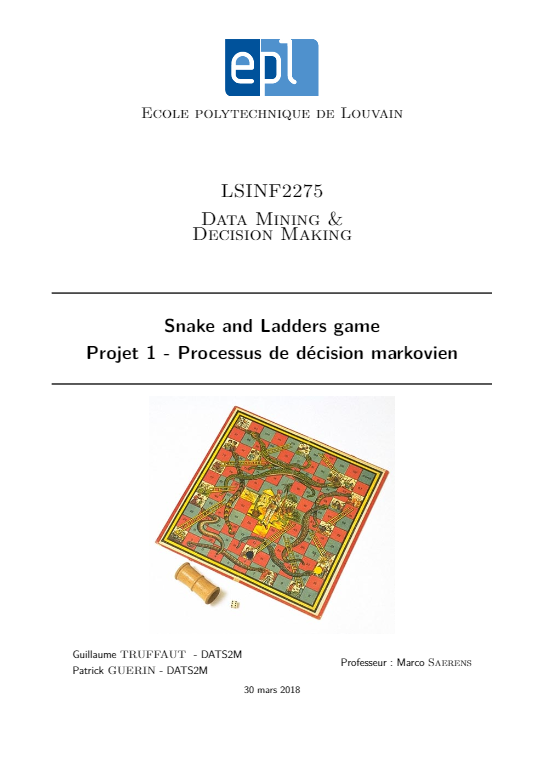

%Solving a variation of the snake and ladder game with dynamic programming

In this variation, the player is given the possibility to choose between 3 dices at each turn,
 and can therefore develop a strategy to win the game (see projectMDP01English.pdf for details)

In this game, the decision of the player depends only on the current state he is in.
 The game can thus be modeled as a markov process and solved using the value iteration algorithm to find the optimal strategy to play.

